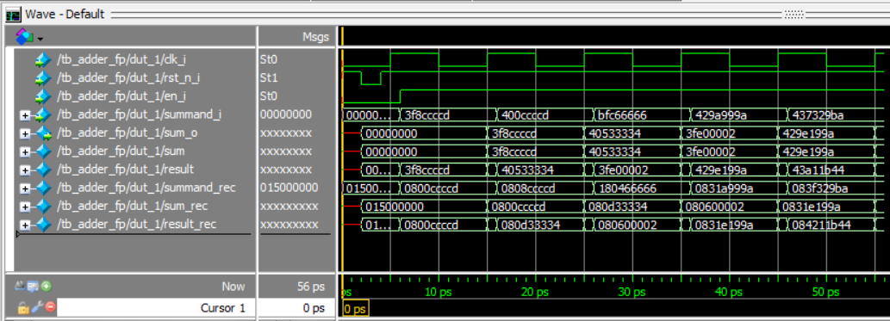
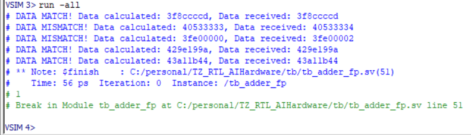

# TZ_RTL_AIHardware

В репозитории находится решение тестового задания написания модуля, складывающего числа с плавающей запятой. Для решения задания использовалась библиотека [**Berkeley HardFloat**](http://www.jhauser.us/arithmetic/HardFloat.html)

Состав репозитория:    
├─lib  
│&emsp;└─[HardFloat-1/](lib/HardFloat-1 "Используемая библиотека")   
│&emsp;└─[HardFloat-1.vi](lib/HardFloat-1.vi "Файл .vi для подключения необходимых модулей из библиотеки")  
├─rtl  
│&emsp;└─[adder_fp.v](rtl/adder_fp.v "Написанный модуль")  
└─tb  
&emsp;└─[tb_adder_fp.sv](tb/tb_adder_fp.sv "Testbench")  
&emsp;└─[test_vectors.tv](tb/test_vectors.tv "Файл с тестовыми векторами")  

 ## Микроархитектурная диаграмма

 

## Описание работы

Модуль adder_fp позволяет производить сложение входного числа в формате float32 c регистром суммы.
Для сложения числа с нулем потребуется 1 такт синхронизируещнго сигнала
(если данным блоком производились вычисления, его необходимо предварительно сбросить).
Для сложения двух чисел потребуется 2 такта синхронизирующего сигнала, для сложения N чисел - N тактов. 
Сложение с входным числом будет произведено только при активном уровне сигнала en_i.  
  
Файл тестовых векторов содержит 5 примеров, для каждого примера указаны входное число и результат вычисления.  
|Входное число|Результат|
|-|--------|
|1.1|1.1|
|2.2|3.3
|-1.55|1.75|
|77.3|79.05|
|243.163|322.213|

## Результат работы

Результат работы  
  

При подсчете суммы со вторым и третьим слагаемым получила погрешность в 0.0000002.